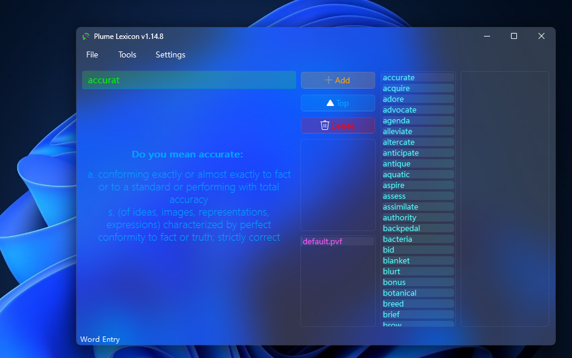
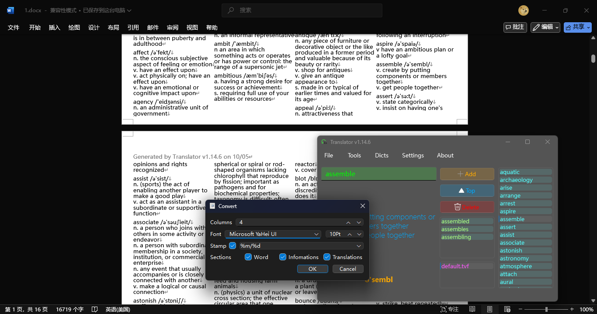

# Plume Lexicon
### A Simple Local Translate Tool at Your Service.

> [!NOTE]
> I'm developing a safer and faster database for this project in order to replance pickle,
> 
> See my repo [**Lexi-DB**](https://github.com/DogeCN/Lexi-DB)

### 💡 Origin
 - The Lexicons Originated from [**ECDICT**](https://github.com/skywind3000/ECDICT)
 - In my quest of *4000 Essential Words* , I grappled with unfamiliar terms that were hard to comprehend and summarize. Hence, the idea for this app blossomed...

### 🤔 Functions

 - Base translate / correct function \
  ")
  

 - Generate documents (using `python-docx` lib) \
  

 - ...

### 💻 Platforms
 - Windows 8.1
 - Windows 10
 - **Windows 11**
